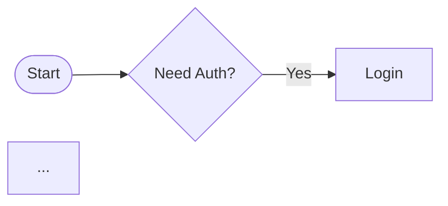

# Mermaid rendering: CI + local rendering of Mermaid diagrams

This folder contains a renderer that converts Mermaid diagrams in `.md`/`.mmd` files into SVG assets. It works locally and in GitHub Actions.

## Where outputs go
- Generated assets are written to `mermaid_js/generated/`, mirroring input subdirectories.
- Example: `mermaid_js/examples/sample_flow.md` →
  - `mermaid_js/generated/examples/sample_flow.svg`

You can reference these directly in blog markdown or presentations.

## Add a new diagram
1. Create a `.md` (or `.mmd`) file anywhere under `mermaid_js/`.
2. Optional YAML frontmatter overrides (first block); first ```mermaid fenced block is used.

```markdown
---
rankdir: LR
nodesep: 120
ranksep: 140
startGap: 16
endGap: 24
labelOffset: 16
roughness: 1.8
curveTightness: 0.25
fontFamily: 'Architects Daughter, cursive'
fontMaxPx: 18
fontMinPx: 10
stroke: '#7B61FF'
fill: '#EFEAFF'
---


```

3. Commit and push. The CI job will render SVG+PNG and commit to `mermaid_js/generated/`.

## Use in your blog/presentation
- HTML: ``

## Commands (local)
- Render one file:

```bash
bun mermaid_js/src/cli/render_any.js --in mermaid_js/examples/sample_flow.md --out mermaid_js/generated/examples/sample_flow.svg
```

- Render all `.md`/`.mmd` under `mermaid_js/`:

```bash
bun mermaid_js/src/cli/render_all.js --inDir mermaid_js --outDir mermaid_js/generated
```

## GitHub Actions
Workflow: [.github/workflows/flowrender.yml](../.github/workflows/flowrender.yml)
- Triggers: push to `mermaid_js/**/*.md|.mmd` (and renderer/styles) and manual dispatch
- Steps: install deps → install Chromium → render all → upload artifacts → auto-commit `mermaid_js/generated/**`

Artifacts are also available in the workflow run for download.

## Notes & troubleshooting
- If you need PDF: render SVG and convert with your preferred tool.

## Advanced
- Styles are defined via CSS variables in [styles/flowchart.css](styles/flowchart.css).
- The interactive demo is [flowchart_external.html](flowchart_external.html) (supports file upload and exports from the browser).
