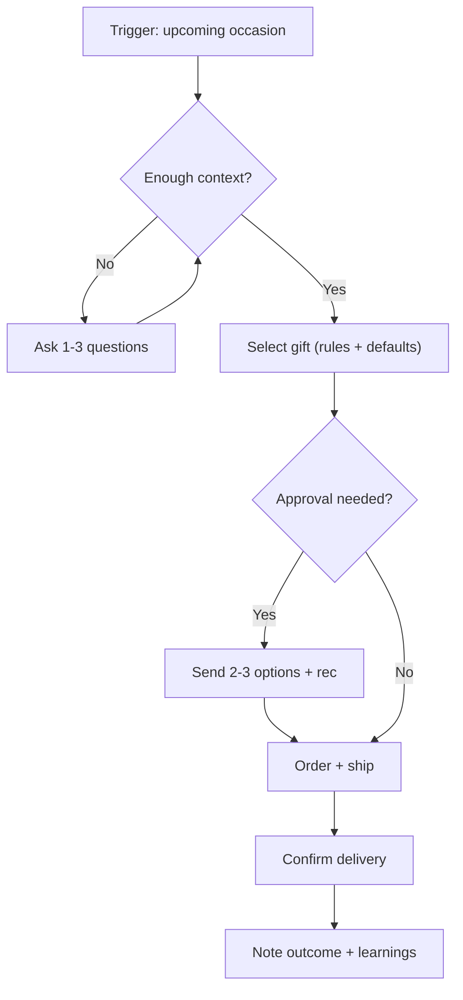

```mermaid
flowchart TB
  T["Trigger: upcoming occasion"] --> C{"Enough context?"}
  C -->|No| Q["Ask 1-3 questions"]
  Q --> C
  C -->|Yes| R["Select gift (rules + defaults)"]
  R --> A{"Approval needed?"}
  A -->|Yes| P["Send 2-3 options + rec"]
  P --> O
  A -->|No| O["Order + ship"]
  O --> D["Confirm delivery"]
  D --> N["Note outcome + learnings"]
```
